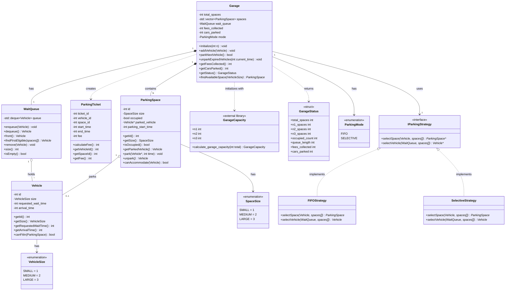
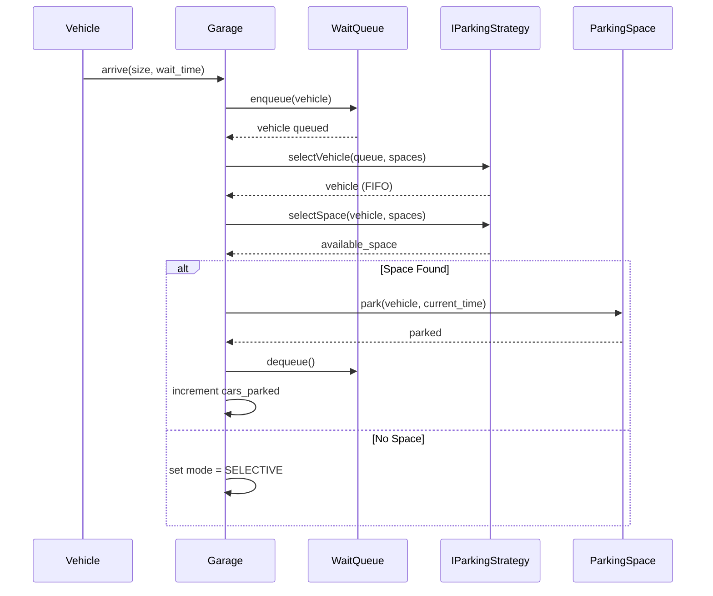
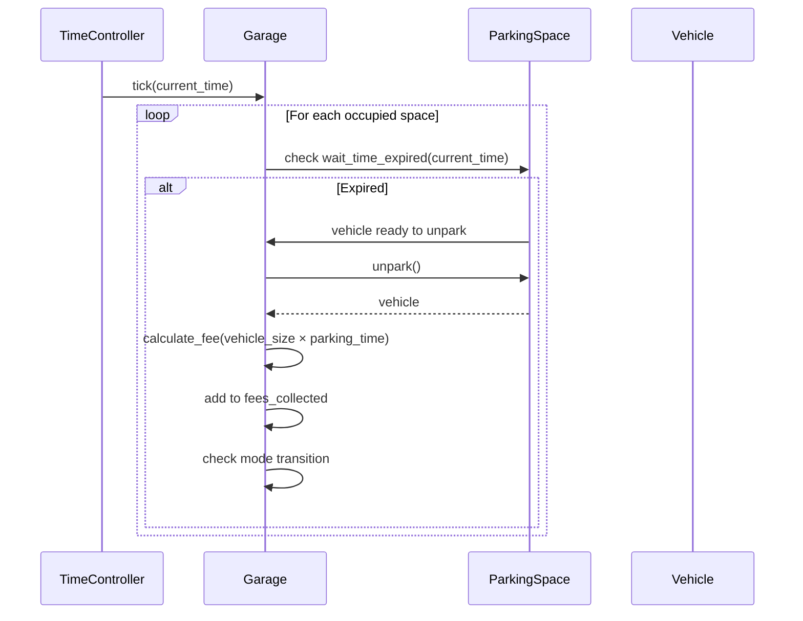
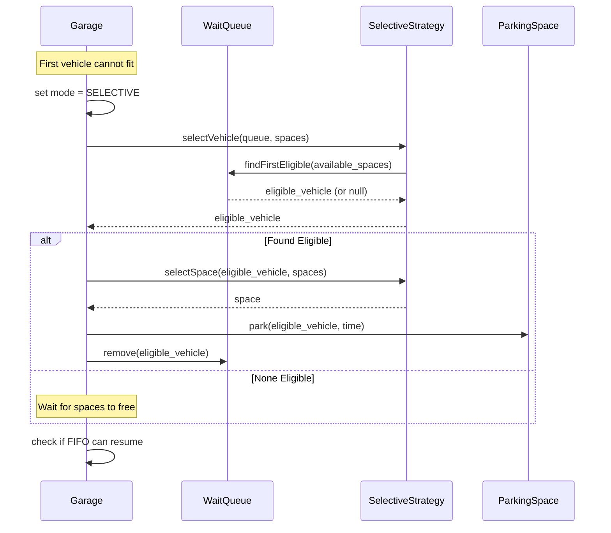
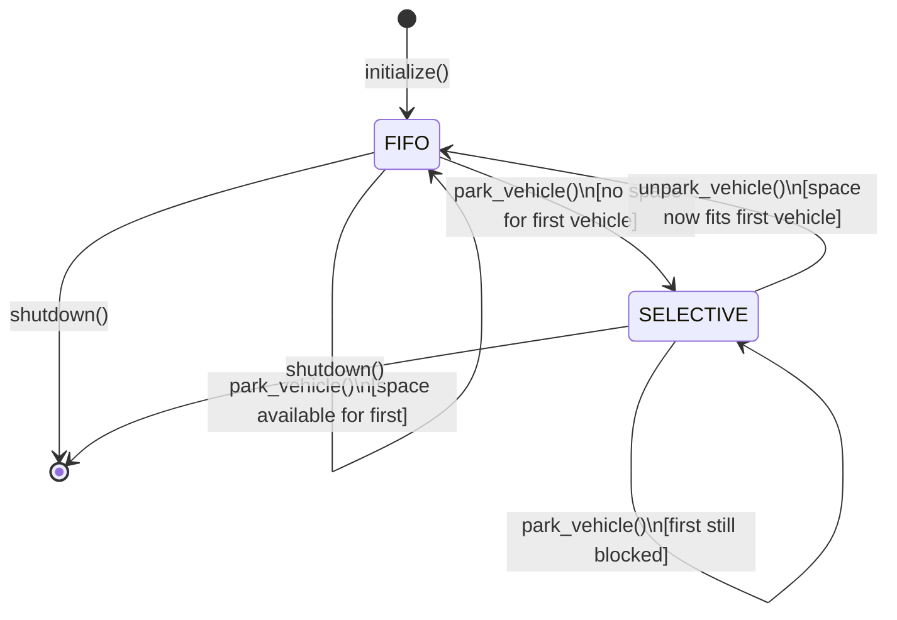
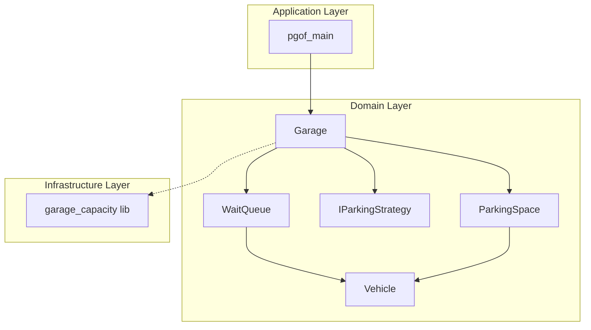

# PGOF Design Document

## 1. Overview

This document defines the object model and technical architecture for PGOF (Parking Garage of the Future), derived from the requirements in [requirements.md](requirements.md).

---

## 2. Object Model

### 2.1 Class Diagram (Mermaid)



### 2.2 Class Descriptions

| Class | Responsibility | Key Attributes |
|-------|---------------|----------------|
| **Vehicle** | Represents an autonomous vehicle seeking parking | id, size, requested_wait_time, arrival_time |
| **ParkingSpace** | Represents a physical parking spot in the garage | id, size, occupied, parked_vehicle |
| **WaitQueue** | Manages the FIFO queue of waiting vehicles | queue (deque), provides first-eligible lookup |
| **Garage** | Central coordinator for all parking operations | spaces, queue, statistics, parking strategy |
| **ParkingTicket** | Records a parking transaction for fee calculation | vehicle_id, space_id, times, fee |
| **GarageCapacity** | External library for space distribution calculation | n1, n2, n3 counts |
| **GarageStatus** | Data transfer object for status queries | all statistics and counts |
| **IParkingStrategy** | Interface for parking algorithm selection | abstract selectSpace/selectVehicle |
| **FIFOStrategy** | Parks vehicles in strict arrival order | implements IParkingStrategy |
| **SelectiveStrategy** | Parks first eligible vehicle when FIFO blocked | implements IParkingStrategy |

---

## 3. Sequence Diagrams

### 3.1 Vehicle Arrival and Parking (Normal Mode)



### 3.2 Vehicle Unparking (Wait Time Expired)



### 3.3 Selective Parking Mode



---

## 4. State Diagram

### 4.1 Garage Parking Mode State Machine



---

## 5. Data Structures

### 5.1 Core Data Types

```cpp
namespace pgof {

// Size enumeration (shared by Vehicle and ParkingSpace)
enum class Size : int {
    SMALL = 1,
    MEDIUM = 2,
    LARGE = 3
};

// Parking mode enumeration
enum class ParkingMode {
    FIFO,       // Park in arrival order
    SELECTIVE   // Park first eligible when FIFO blocked
};

// Vehicle structure
struct Vehicle {
    int id;
    Size size;
    int requested_wait_time;  // 1-10 time units
    int arrival_time;
    
    bool canFitIn(Size space_size) const {
        return static_cast<int>(space_size) >= static_cast<int>(size);
    }
};

// Parking space structure
struct ParkingSpace {
    int id;
    Size size;
    bool occupied = false;
    std::optional<Vehicle> parked_vehicle;
    int parking_start_time = 0;
    
    bool canAccommodate(const Vehicle& v) const {
        return !occupied && v.canFitIn(size);
    }
};

// Parking ticket for fee tracking
struct ParkingTicket {
    int ticket_id;
    int vehicle_id;
    int space_id;
    int start_time;
    int end_time;
    int fee;  // vehicle_size * parking_time
};

// Status query response
struct GarageStatus {
    int total_spaces;
    int n1_spaces, n2_spaces, n3_spaces;
    int occupied_n1, occupied_n2, occupied_n3;
    int queue_length;
    int fees_collected;
    int cars_parked;
};

} // namespace pgof
```

### 5.2 Parking Compatibility Rules

| Vehicle Size | Can Park In Space Sizes | Implementation |
|--------------|------------------------|----------------|
| SMALL (1) | 1, 2, 3 | `space_size >= 1` |
| MEDIUM (2) | 2, 3 | `space_size >= 2` |
| LARGE (3) | 3 only | `space_size >= 3` |

---

## 6. Interface Definitions

### 6.1 IParkingStrategy Interface

```cpp
namespace pgof {

class IParkingStrategy {
public:
    virtual ~IParkingStrategy() = default;
    
    // Select which vehicle to park next from the queue
    virtual Vehicle* selectVehicle(
        WaitQueue& queue,
        const std::vector<ParkingSpace>& spaces
    ) = 0;
    
    // Select which space to use for a given vehicle
    virtual ParkingSpace* selectSpace(
        const Vehicle& vehicle,
        std::vector<ParkingSpace>& spaces
    ) = 0;
};

} // namespace pgof
```

### 6.2 Garage Public Interface

```cpp
namespace pgof {

class Garage {
public:
    // Initialize garage with N total spaces
    explicit Garage(int total_spaces);
    
    // Vehicle management
    void addVehicle(const Vehicle& vehicle);
    bool parkNextVehicle(int current_time);
    void unparkExpiredVehicles(int current_time);
    
    // Statistics
    int getFeesCollected() const;
    int getCarsParked() const;
    GarageStatus getStatus() const;
    
    // Configuration
    void setStrategy(std::unique_ptr<IParkingStrategy> strategy);
    
private:
    std::vector<ParkingSpace> spaces_;
    WaitQueue queue_;
    std::unique_ptr<IParkingStrategy> strategy_;
    int fees_collected_ = 0;
    int cars_parked_ = 0;
    ParkingMode mode_ = ParkingMode::FIFO;
};

} // namespace pgof
```

---

## 7. Design Patterns Applied

| Pattern | Application | Benefit |
|---------|-------------|---------|
| **Strategy** | IParkingStrategy with FIFO/Selective implementations | Allows swappable parking algorithms |
| **Repository** | Garage manages collections of spaces and vehicles | Centralized data access |
| **Value Object** | Vehicle, ParkingTicket, GarageStatus | Immutable data transfer |
| **Factory** | GarageCapacity::calculate_garage_capacity | Encapsulates space distribution logic |

---

## 8. Component Dependencies



---

## 9. Traceability Matrix

| Requirement | Design Element | Implementation Notes |
|-------------|---------------|---------------------|
| UC-001 System Init | Garage constructor, GarageCapacity | Validate N, distribute spaces |
| UC-002 Vehicle Arrival | WaitQueue::enqueue() | FIFO ordering preserved |
| UC-003 Normal Parking | FIFOStrategy, Garage::parkNextVehicle() | First-come-first-served |
| UC-004 Selective Parking | SelectiveStrategy, WaitQueue::findFirstEligible() | Skip blocked vehicles |
| UC-005 Unpark | Garage::unparkExpiredVehicles() | Time-based expiration |
| UC-006 Fee Calculation | ParkingTicket::calculateFee() | fee = size × time |
| UC-007 Statistics | Garage::getFeesCollected/CarsParked() | Running totals |
| UC-008 Status Query | Garage::getStatus() | Returns GarageStatus struct |


The architecture diagram is written to PGOF_design.drawio.svg. Here's a summary of what it captures:

Six swim-lane columns:

Lane Key elements
Startup/Config main() → AppConfig (mode + algorithm selection) → GarageCapacityLib → AlgorithmFactory
User Interface IUserInterface → CLIInterface or QtGUIInterface (selected at startup)
Input/Events Car value type → WaitQueue (Observable/Subject) → ITimeCycleObserver interface
Core Engine ParkingEngine (Observer) → IParkingAlgorithm (Strategy) → FIFOAlgorithm / BestFitAlgorithm + FeeCollector
Domain Model Garage → ParkingSpace → garage_capacity struct (from existing lib)
Output/Reporting IReporter → ConsoleReporter or QtDashboardReporter + SimulationStats
Two annotation boxes at the bottom:

Time-Cycle Loop — the 6-step sequence each tick (enqueue → notify → find_space → unpark → fee → report)
SOLID Mapping — which principle each design decision satisfies

---
references:

- "File: /apps/pgof_main/src/pgof_main.cpp"
generationTime: 2026-06-23T03:42:52.550Z

---

```mermaid
sequenceDiagram
    participant Main as Main Application
    participant RNG as Random Generators
    participant Garage as Garage
    participant Vehicle as Vehicle
    participant Ticket as Ticket

    %% Initialization Phase
    rect rgb(230, 245, 255)
        Note over Main,Garage: Initialization Phase
        Main->>Garage: Garage(TOTAL_SPACES=100)
        activate Garage
        Garage-->>Main: Garage instance created
        deactivate Garage
        
        Main->>Garage: getStatus()
        activate Garage
        Garage-->>Main: GarageStatus (spaces breakdown)
        deactivate Garage
        
        Note right of Main: Display space allocation:<br/>Size-1, Size-2, Size-3
    end

    %% Random Generator Setup
    rect rgb(255, 245, 230)
        Note over Main,RNG: Random Generator Setup
        Main->>RNG: Initialize mt19937 generator
        activate RNG
        RNG-->>Main: Generator ready
        deactivate RNG
        
        Main->>RNG: Create size_dist(1,3)
        activate RNG
        RNG-->>Main: Size distribution ready
        deactivate RNG
        
        Main->>RNG: Create wait_dist(1,10)
        activate RNG
        RNG-->>Main: Wait distribution ready
        deactivate RNG
    end

    %% Simulation Loop
    rect rgb(240, 255, 240)
        Note over Main,Ticket: Simulation Loop (T=0 to T=50)
        
        loop For each time step (0 to SIMULATION_TIME)
            
            %% Vehicle Generation (every 2 time units)
            alt Time % 2 == 0 AND vehicles < 30
                Main->>RNG: size_dist(gen)
                activate RNG
                RNG-->>Main: Random size (1-3)
                deactivate RNG
                
                Main->>RNG: wait_dist(gen)
                activate RNG
                RNG-->>Main: Random wait time (1-10)
                deactivate RNG
                
                Main->>Vehicle: Vehicle(id, size, wait_time, arrival_time)
                activate Vehicle
                Vehicle-->>Main: New Vehicle instance
                deactivate Vehicle
                
                Main->>Garage: addVehicle(vehicle)
                activate Garage
                Garage-->>Main: Vehicle added to queue
                deactivate Garage
                
                Note right of Main: Log vehicle arrival
            end
            
            %% Parking Loop
            loop While parkNextVehicle returns true
                Main->>Garage: parkNextVehicle(current_time)
                activate Garage
                Garage-->>Main: true (vehicle parked)
                deactivate Garage
                
                Main->>Garage: getMode()
                activate Garage
                Garage-->>Main: ParkingMode (FIFO/SELECTIVE)
                deactivate Garage
                
                Note right of Main: Log parking event with mode
            end
            
            %% Unpark Expired Vehicles
            Main->>Garage: unparkExpiredVehicles(current_time)
            activate Garage
            
            Note over Garage: Check all parked vehicles<br/>for expiration
            
            Garage-->>Main: vector of Tickets
            deactivate Garage
            
            loop For each expired ticket
                Main->>Ticket: getVehicleId()
                activate Ticket
                Ticket-->>Main: Vehicle ID
                deactivate Ticket
                
                Main->>Ticket: getFee()
                activate Ticket
                Ticket-->>Main: Parking fee amount
                deactivate Ticket
                
                Note right of Main: Log unpark event with fee
            end
            
        end
    end

    %% Final Statistics
    rect rgb(255, 240, 245)
        Note over Main,Garage: Final Statistics
        Main->>Garage: getStatus()
        activate Garage
        Garage-->>Main: Final GarageStatus
        deactivate Garage
        
        Main->>Garage: status.getTotalOccupied()
        activate Garage
        Garage-->>Main: Occupied space count
        deactivate Garage
        
        Note right of Main: Display final stats:<br/>- Cars parked<br/>- Fees collected<br/>- Queue length<br/>- Occupied spaces
    end
    ```
